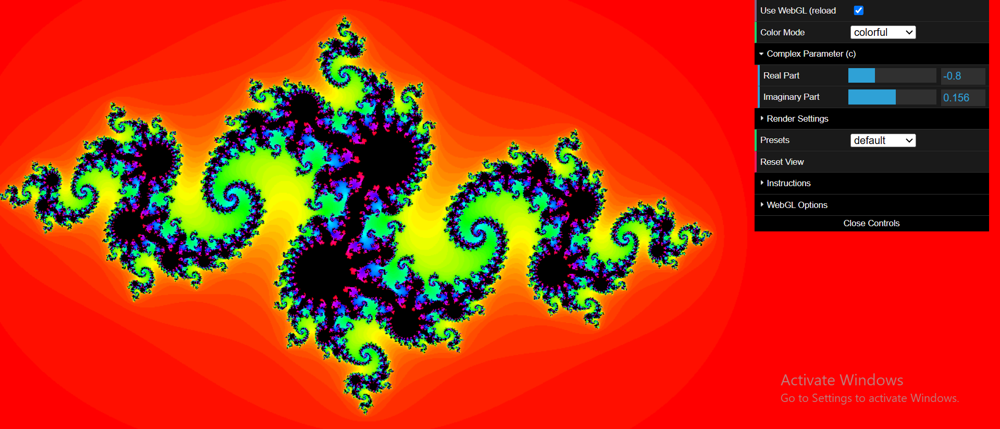

# Julia Set Explorer

An interactive web-based Julia set fractal explorer with real-time parameter adjustments and visualization options.

## Features

- Interactive Julia set exploration
- Real-time parameter adjustments
- Both Canvas 2D and WebGL rendering options
- Color mode options (colorful and black & white)
- Zoom and pan functionality
- Customizable iteration count for detail control
- Preset Julia sets configurations
- Responsive design that works across different screen sizes

## Getting Started

### Prerequisites

- A modern web browser with JavaScript enabled
- WebGL support for hardware acceleration (optional)

### Installation

1. Clone or download this repository
2. Open `index.html` in your web browser

No build steps or external dependencies are required for basic functionality.

## Controls

- **Click**: Set the center point of the view
- **Mouse wheel**: Zoom in and out
- **GUI Panel**:
  - **Use WebGL**: Toggle between WebGL (faster) and Canvas 2D rendering
  - **Color Mode**: Switch between colorful gradient and black & white display
  - **Complex Parameter (c)**: Adjust the real and imaginary parts of the constant c
  - **Max Iterations**: Control the detail level and rendering depth
  - **Scale**: Adjust the zoom level
  - **Presets**: Choose from predefined interesting Julia sets
  - **Reset View**: Return to the default view

## Technical Details

This Julia Set Explorer implements:

- ES6 modules for clean code organization
- Complex number mathematics
- Multiple rendering backends (Canvas 2D and WebGL)
- WebGL shader programming for hardware-accelerated rendering
- Interactive UI with dat.gui
- Responsive canvas sizing

## How Julia Sets Work

Julia sets are fractals that exist in the complex plane. They are generated by iterating the function f(z) = z² + c for different complex numbers z, where c is a fixed complex parameter. The coloring is determined by how quickly the sequence escapes to infinity.

## Project Structure

- `index.html`: Main entry point
- `loop.js`: Animation and interaction handling
- `js/math/`: Mathematical utilities (Complex numbers, Vector operations)
- `js/julia/`: Julia set logic and UI controls
- `js/rendering/`: Rendering implementations (Canvas 2D and WebGL)
- `css/styles.css`: Basic styling

## License

This project is released under the MIT License - see the LICENSE file for details.

## Acknowledgments

- Uses [dat.GUI](https://github.com/dataarts/dat.gui) for the user interface
